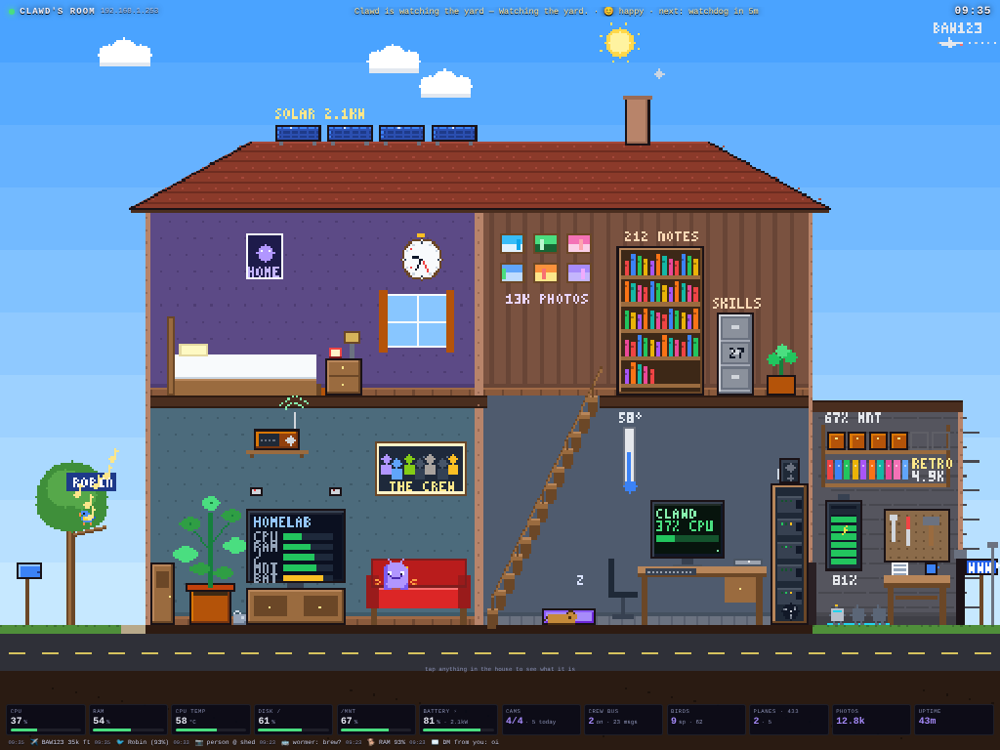
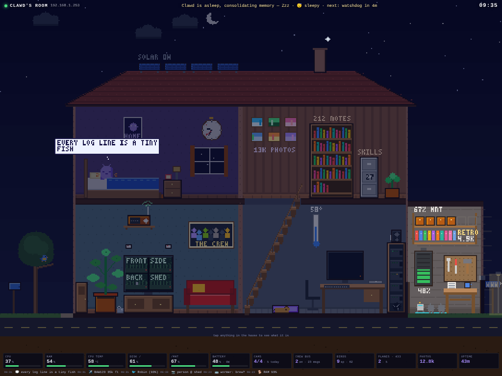

# Clawd's Room

A living pixel-art house for Clawd, built to sit on an iPad on the wall, 24/7. Every object in
the house is something real on the homelab, and the house reacts live: the bird sings when
Chirpa hears a species, the dog barks when the watchdog does, the crew bus pulls up when
someone posts on the bus, the lights dim when the FoxESS battery runs flat, and Clawd himself
walks between the desk, the couch, the bookshelves, the workbench and his bed depending on
what he is actually doing.




It is one small zero-dependency Node server plus a canvas app. Nothing else to install.

## Quick start

```bash
git clone https://github.com/defthrets/clawdsroom /opt/clawdsroom
cd /opt/clawdsroom
npm start            # → http://<homelab>:8787/
```

Open it in a browser. If nothing is wired up yet, the room runs in **demo mode** (purple dot
in the title bar) so you can see everything move. Add `?demo=1` to force it, `?hour=23` to
preview the night.

Run it on the homelab itself and `system.*` (CPU, RAM, temperature, `/` and `/mnt` usage,
uptime) is collected automatically from `/proc`, `/sys` and `df`.

Also included: a `Dockerfile` + `compose.yaml`, and a systemd unit in `deploy/`.

## Putting it on the iPad

1. On the iPad, open Safari and go to `http://192.168.1.253:8787/` (or wherever it runs).
2. Share → **Add to Home Screen**. Launch it from there: it opens full screen, no browser chrome.
3. Settings → Display & Brightness → **Auto-Lock → Never**. Keep it plugged in.
4. Optional, to stop stray taps leaving the app: Settings → Accessibility → **Guided Access**,
   then triple-click the top button inside the app.

The page keeps a Server-Sent Events connection to the server, reconnects on its own, falls
back to demo mode if the homelab goes away (and comes back when it returns), and reloads
itself once a day so a 24/7 tab never goes stale.

**Tap anything** in the house (or a tile in the stat strip) for a card with what it represents,
its live numbers, and a trend chart of the last few hours where there is one. Tap Clawd himself
for what he is doing, for how long, and what he has been up to today.

When the homelab hasn't given him a job (`clawd.activity` is `idle`) he potters about on his
own: looks out of the window, chills or naps on the couch, pets the dog, checks the post,
chats to the bird, waters the plant, browses the shelves, checks the battery, has a little
dance. He only stands still while he is actually doing something or having a breather. At
sunrise and sunset he does the rounds with the watering can: the big plant in the living room,
then the one upstairs. Skip a day and they droop.

**His face shows how he feels.** Set `clawd.mood` from the homelab (`happy`, `calm`, `focused`,
`excited`, `surprised`, `alert`, `worried`, `sad`, `angry`, `bored`, `sleepy`) and the eyebrows,
eyes and mouth follow. The room also reads the situation itself: worried when the battery is
low or the watchdog is unhappy, bored after a long quiet idle, focused at the desk, a flash of
excitement when you message him, a scowl when the gateway dies. The title bar says what he is
feeling and a little badge pops over his head when it changes.

## Wiring it to the homelab

The whole contract is two HTTP endpoints: **patch the state** (what is true now) and
**push an event** (something just happened). Full reference in [docs/STATE.md](docs/STATE.md).

`scripts/room` is a tiny CLI around them (needs `curl`; set `ROOM_URL` if not local):

```bash
room do terminal "Restarting Frigate."          # Clawd walks to the desk and types
room do watching "Eyes on the shed cam."        # couch, TV on the cams
room do sleeping                                # bed, Zzz, memory consolidation
room say "Fan curve sorted, cupboard's quiet."  # speech bubble + speaker
room state power.battery=42 power.solar_w=1850 power.charging=true
room event bird species=Blackbird confidence=0.91
room event bark "reason=disk /mnt 92%" level=warning
room event telegram from=you "text=you about?"
room event bus from=hermes "text=nightly build green"
room event cam camera=shed label=person
room event subagent action=spawn name=researcher
room event cron "name=morning brief"
```

Or straight from anything that can speak HTTP:

```bash
curl -X POST http://192.168.1.253:8787/api/state -H 'content-type: application/json' \
  -d '{"clawd":{"activity":"remote","status":"SSH into Wormer."}}'
curl -X POST 'http://192.168.1.253:8787/api/event?type=plane&callsign=BAW123&alt=35000'
```

### Who pushes what

| Thing | Push |
|---|---|
| **Clawd's activity** | From his hooks / skill: `room do <activity> "status"` whenever he starts something (`terminal`, `watching`, `remote`, `reading`, `tinkering`, `browsing`, `delegating`, `writing`, `thinking`, `looking`, `speaking`, `idle`). `idle` becomes `sleeping` automatically at night or after `settings.sleep_after_min` without activity. |
| **TTS / vision** | `room say "..."` and `room event look what=photo`. |
| **Memory + skills** | `room state memory.notes=212 memory.skills=27` from cron; `room event diary` after the nightly diary; `room event dream "text=..."` from the consolidation job. |
| **Subagents** | `room event subagent action=spawn name=x` / `action=done`. |
| **Frigate** | `scripts/examples/frigate.sh` (polls `/api/stats` and the newest event). |
| **Immich** | `scripts/examples/immich.sh` (photo count from `/api/server/statistics`). |
| **FoxESS** | Whatever already reads the inverter (Home Assistant, a FoxESS cloud poller): `room state power.battery=.. power.solar_w=.. power.load_w=.. power.charging=..`. |
| **Chirpa** | On each detection: `room event bird species=Robin confidence=0.9 new_species=true`. |
| **clawd-watchdog** | `room event bark "reason=RAM 93%" level=alert`, and `room state watchdog.state=ok watchdog.alerts=[]` when it clears. |
| **Crew bus / Telegram** | `room event bus from=hermes "text=..."`, `room event telegram from=you "text=..."`, and `room state telegram.unread=0` once read. `room state 'bus.online=["hermes","wormer"]'` for who is on. |
| **RTL-SDR** | `room state sdr.planes=3 sdr.sensors=5` from the dump1090 / rtl_433 side; `room event plane callsign=.. alt=..` for a flyover. |
| **Cron** | `room event cron "name=morning brief"` as the first line of each job (see `scripts/examples/crontab.example`). The schedule itself lives in `cron[]` in the state. |
| **Crew presence** | `room state crew.hermes.online=true`. |
| **Weather** | `room state weather.condition=rain weather.sunrise=06:40 weather.sunset=18:20` (optional; drives the sky). |

Everything is optional. Whatever is not wired stays at its default and the room still looks fine.

## Configuration

Environment variables for the server:

| Var | Default | |
|---|---|---|
| `PORT`, `HOST` | `8787`, `0.0.0.0` | |
| `CLAWDSROOM_TOKEN` | unset | If set, `POST`/`PUT` need `Authorization: Bearer <token>` (or `?token=`). Reads stay open. |
| `DATA_DIR` | `./data` | Where `state.json` is persisted. |
| `COLLECT_SYSTEM` | `1` on Linux | Auto-fill `system.*` every `SYSTEM_INTERVAL_MS` (10000). |
| `DISK_ROOT`, `DISK_MNT` | `/`, `/mnt` | Paths reported as `disk_root` / `disk_mnt`. |

Display settings live in the state (`settings.*`): `sleep_after_min` (20), `reload_hours` (24),
`theme_hour_offset` (shift the day/night cycle for testing).

## Layout

```
server/server.js     HTTP + SSE + persistence + Linux system collector (no dependencies)
public/js/defaults.js  the state contract (shared by server and browser)
public/js/reducer.js   deep-merge + what each event does to the state (shared)
public/js/scene.js     the house: layout, furniture, sky, lighting, tap targets
public/js/actors.js    Clawd, the dog, the bird, the bots, the bus
public/js/effects.js   particles, labels, smoke, rain
public/js/hud.js       stat tiles, ticker, toasts, info card
public/js/demo.js      the simulation used when nothing is wired up
scripts/room           CLI; scripts/examples/ collectors
```

The scene is drawn on a 480×360 pixel canvas scaled to the screen with nearest-neighbour
sampling, 4:3 like the iPad, at 30 fps. `npm test` runs the reducer and API tests.

## License

MIT
